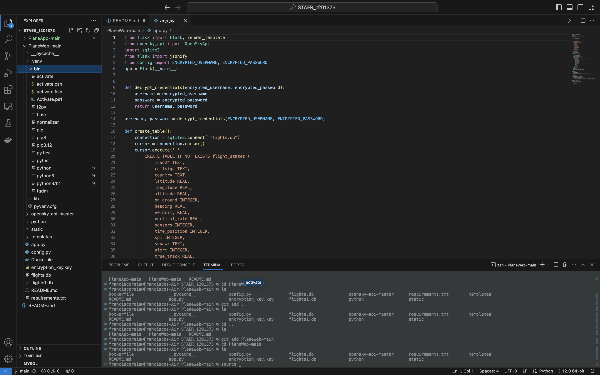
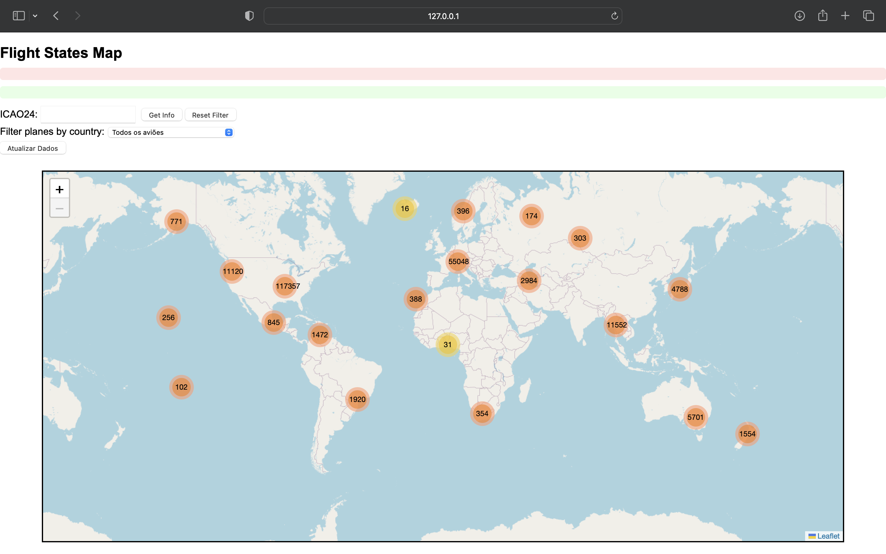
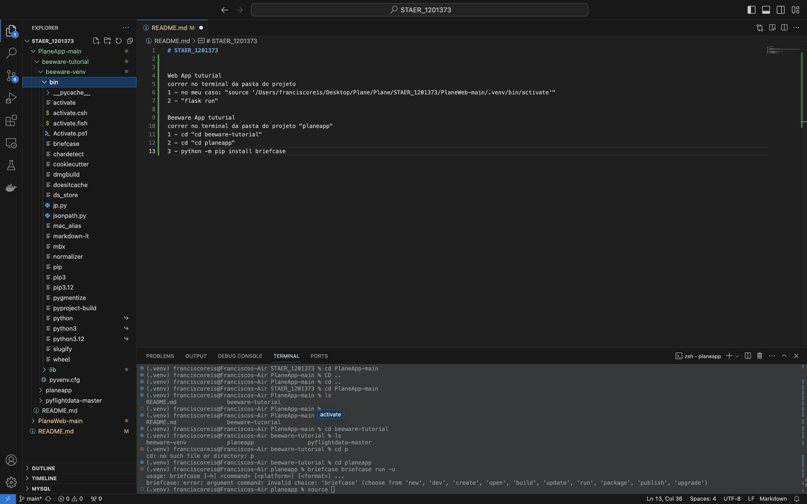

# STAER_1201373

## Web App tutorial

Para executar o tutorial do Web App, siga estas etapas:

1. No terminal, navegue até a pasta do projeto.
2. É preciso ativar a envirement do projeto. No meu caso, o comando é: source '/Users/franciscoreis/Desktop/Plane/Plane/STAER_1201373/PlaneWeb-main/.venv/bin/activate'.
O mais facil é arrastar o ficheiro para o terminal como na imagem.

3. Execute o comando `flask run`.
4. Abrir um navegador: http://127.0.0.1:5000
### Resultado:

Caso receba um erro porque o Flask não está instalado, execute o comando `pip install Flask`.

## Beeware App tutorial

Para executar o tutorial do Beeware App, siga estas etapas:

1. No terminal, navegue até a pasta do projeto "planeapp".
2. É preciso ativar a envirement do projeto. No meu caso, o comando é: source '/Users/franciscoreis/Desktop/Plane/Plane/STAER_1201373/PlaneApp-main/beeware-tutorial/beeware-venv/bin/activate'
O mais facil é arrastar o ficheiro para o terminal como na imagem.

3. Mude para o diretório "beeware-tutorial": cd beeware-tutorial
4. Mude para o diretório "planeapp": cd planeapp
5. Execute o comando: briefcase run -u.
Resultado:

Caso receba um erro porque o Briefcase não está instalado, execute o comando python -m pip install briefcase.

